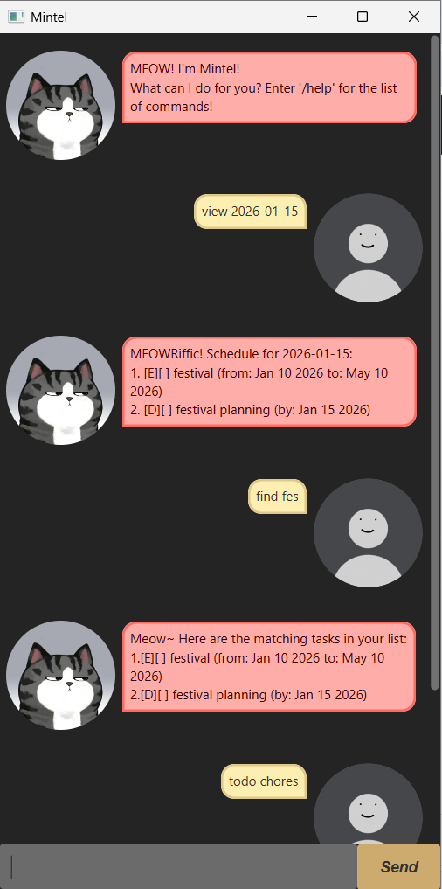

# 🐱 Mintel User Guide



**Mintel** is a desktop task manager chatbot designed for users who prefer typing over mouse clicks.
It helps you track todos, deadlines, and events through an intuitive command-line interface with a friendly GUI.

---

## Quick Start

1. Ensure you have **Java 17** installed.
2. Download the latest `mintel.jar` from [releases](https://github.com/kihoo56tkr/ip/releases).
3. Double-click the JAR file to launch Mintel.
4. Type a command and press Enter to start managing your tasks!

---

## Adding Todos

Adds a simple task without any date.

**Format:** `todo DESCRIPTION`

**Example:** `todo read book`

**Expected outcome:**
```
MEOWRiffic! ദ്ദി(• ⩊ •^ I've added this task:
[T][ ] read book
Now you have 1 tasks in the list.
```


---

## Adding Deadlines

Adds a task that needs to be done by a specific date.

**Format:** `deadline DESCRIPTION /by DATE`

**Date formats accepted:**
- `yyyy-MM-dd` (e.g., `2026-03-15`)
- `MMM d yyyy` (e.g., `Mar 15 2026`)

**Example:** `deadline homework /by 2026-03-15`

**Expected outcome:**

```
MEOWRiffic! ദ്ദി(• ⩊ •^ I've added this task:
[D][ ] homework (by: Mar 15 2026)
Now you have 2 tasks in the list.
```
---

## Adding Events

Adds an event with a start and end date.

**Format:** `event DESCRIPTION /from DATE /to DATE`

**Example:** `event team meeting /from 2026-03-15 /to 2026-03-16`

**Expected outcome:**
```
MEOWRiffic! ദ്ദി(• ⩊ •^ I've added this task:
[E][ ] team meeting (from: Mar 15 2026 to: Mar 16 2026)
Now you have 3 tasks in the list.
```
> ⚠️ **Note:** Start date must be before or equal to end date.
---

## Listing Tasks

Shows all todos, deadlines, and events in your list.

**Format:** `list`

**Expected outcome:**
```
MEOWRiffic! ദ്ദി(• ⩊ •^ Here are the tasks in your list:
1.[T][ ] read book
2.[D][ ] homework (by: Mar 15 2026)
3.[E][ ] team meeting (from: Mar 15 2026 to: Mar 16 2026)
```

---

## Finding Tasks

Finds tasks that contain ALL specified keywords.

**Format:** `find KEYWORD [MORE_KEYWORDS]`

**Example:** `find book read`

**Expected outcome:**
```
Meow~ Here are the matching tasks in your list::
1.[T][ ] read book
```

---

## Viewing Schedule

Shows all deadlines and events scheduled on a specific date.

**Format:** `view DATE`

**Example:** `view 2026-03-15`

**Expected outcome:**
```
MEOWRiffic! ദ്ദി(• ⩊ •^ Schedule for 2026-03-15:
1. [D][] homework (by: 2026-03-15)
2. [E][] team meeting (2026-03-15 to 2026-03-16)
```

---

## Marking Tasks

Marks a task as done.

**Format:** `mark INDEX`

**Example:** `mark 2`

**Expected outcome:**
```
MEOWRiffic! ദ്ദി(• ⩊ •^ I've marked this task as done:
[D][X] homework (by: Mar 15 2026)
```
---

## Unmarking Tasks

Marks a task as not done.

**Format:** `unmark INDEX`

**Example:** `unmark 2`

**Expected outcome:**
```
MEOWRiffic! ദ്ദി(• ⩊ •^ I've marked this task as not done yet:
[D][] homework (by: Mar 15 2026)
```

---

## Deleting Tasks

Removes a task from your list.

**Format:** `delete INDEX`

**Example:** `delete 3`

**Expected outcome:**
```
MEOWRiffic! ദ്ദി(• ⩊ •^ I've removed this task::
[E][ ] team meeting (from: Mar 15 2026 to: Mar 16 2026)
Now you have 2 tasks in the list.
```

---

## Getting Help

Displays this help message with all available commands.

**Format:** `help` or `/help`

**Expected outcome:**
```
<Mintel Commands>>

Adding Tasks:
todo DESCRIPTION
e.g., todo read book
...
```

---

## Exiting Mintel

Closes the application.

**Format:** `bye`

**Expected outcome:**
```
Meow Meow~ Bye! See you again soon!
(The window will close automatically after 3 seconds)
```


---

## Command Summary

| Action | Format | Examples                                        |
|--------|--------|-------------------------------------------------|
| **Add Todo** | `todo DESCRIPTION` | `todo read book`                                |
| **Add Deadline** | `deadline DESCRIPTION /by DATE` | `deadline homework /by 2026-03-15`              |
| **Add Event** | `event DESCRIPTION /from DATE /to DATE` | `event meeting /from 2026-03-15 /to 2026-03-16` |
| **List** | `list` | `list`                                          |
| **Find** | `find KEYWORD...` | `find book read`                                |
| **View Schedule** | `view DATE` | `view 2026-03-15`                               |
| **Mark** | `mark INDEX` | `mark 2`                                        |
| **Unmark** | `unmark INDEX` | `unmark 2`                                      |
| **Delete** | `delete INDEX` | `delete 3`                                      |
| **Help** | `/help` | `/help`                                         |
| **Exit** | `bye` | `bye`                                           |
